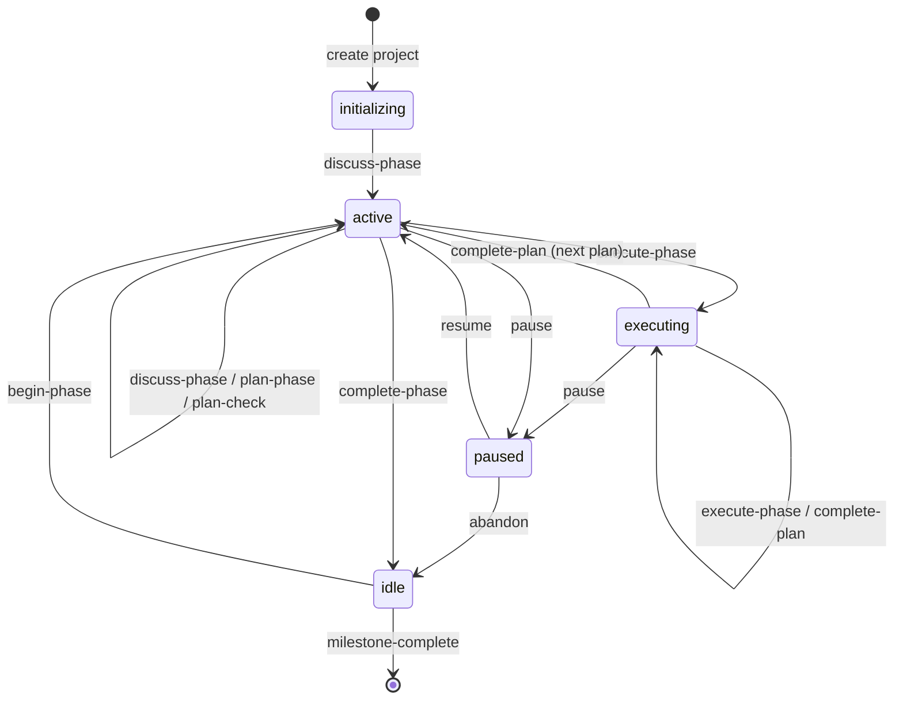

# STATE.md Finite State Machine

This document describes the lifecycle states stored in `.planning/STATE.md` and the valid transitions between them. The `gsd_next_action` tool uses this FSM to suggest the next appropriate action without mutating `STATE.md`.

## State definitions

| Status | Meaning | Typical `next_action` |
| -------- | --------- | ---------------------- |
| `initializing` | Project scaffold exists but no phase has started. | `discuss-phase` |
| `idle` | No phase is currently active; work is between phases or complete. | `begin-phase` or `milestone-complete` |
| `active` | A phase is in progress, usually in discuss/plan. | `discuss-phase`, `plan-phase`, `execute-phase` |
| `executing` | A plan within the active phase is being executed. | `execute-phase`, `complete-plan` |
| `paused` | Active work has been paused. | `resume` or `abandon` |

## Transition table

| Current status | Current `next_action` | Valid actions | Recommended action | Resulting status |
| ---------------- | ---------------------- | --------------- | -------------------- | ------------------ |
| `initializing` | `discuss-phase` | `discuss-phase` | `discuss-phase` | `active` |
| `idle` | `begin-phase` | `begin-phase`, `milestone-complete` | `begin-phase` | `active` |
| `active` | `discuss-phase` | `discuss-phase`, `plan-phase` | `discuss-phase`¹ | `active` |
| `active` | `plan-phase` | `plan-phase`, `plan-check` | `plan-phase` | `active` |
| `active` | `execute-phase` | `execute-phase`, `pause` | `execute-phase` | `executing` |
| `executing` | `execute-phase` | `execute-phase`, `complete-plan`, `pause` | `execute-phase` | `executing` / `active`² |
| `paused` | `resume` | `resume`, `abandon` | `resume` | `active` / `idle`³ |

¹ If `CONTEXT.md` already exists for the active phase, the recommendation shifts to `plan-phase`.
² `complete-plan` returns to `active` with `next_action: execute-phase` for the next plan.
³ `resume` returns to `active`; `abandon` returns to `idle`.

## Mermaid state diagram

## Tool mapping

| Action | Host-side tool | Artifact produced / updated |
| -------- | ---------------- | ---------------------------- |
| `discuss-phase` | `gsd_state_update` / manual | `.planning/phases/<NN>-<slug>/<NN>-CONTEXT.md` |
| `plan-phase` | `gsd_plan` subagent call | `.planning/phases/<NN>-<slug>/<NN>-<PP>-PLAN.md` |
| `plan-check` | `gsd_plan_check` subagent call | `.planning/phases/<NN>-<slug>/<NN>-VALIDATION.md` |
| `execute-phase` | `gsd_execute` subagent call | `.planning/phases/<NN>-<slug>/<NN>-<PP>-SUMMARY.md` |
| `complete-plan` | `gsd_state_advance` operation `complete-plan` | Updates `current_plan`, `status` |
| `begin-phase` | `gsd_state_advance` operation `begin-phase` | Sets `active_phase`, `status: active` |
| `complete-phase` | `gsd_state_advance` operation `complete-phase` | Sets `status: idle`, clears active phase |
| `pause` | `gsd_state_update` field `status` | `status: paused`, `paused_at` |
| `resume` | `gsd_state_update` field `status` | `status: active` |
| `milestone-complete` | `gsd-milestone-complete` agent | `.planning/MILESTONES.md`, `STATE.md` reset |

## Status values in code

The following `status` values are assigned by the GSD command tools:

- `initializing` — set by the `STATE.md` template when a project is first scaffolded.
- `active` — set by `gsd_state_advance({ operation: "begin-phase" })`.
- `executing` — set by `gsd_state_advance({ operation: "complete-plan" })`.
- `idle` — set by `gsd_state_advance({ operation: "complete-phase" })`.
- `paused` — set by `gsd_state_update({ field: "status", value: "paused" })` or the `gsd-pause` agent.
